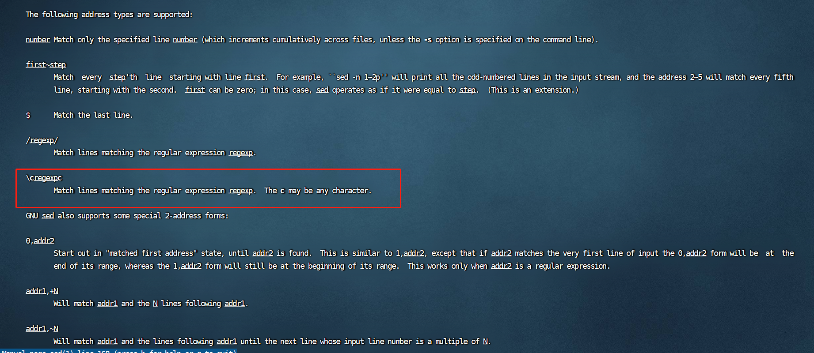
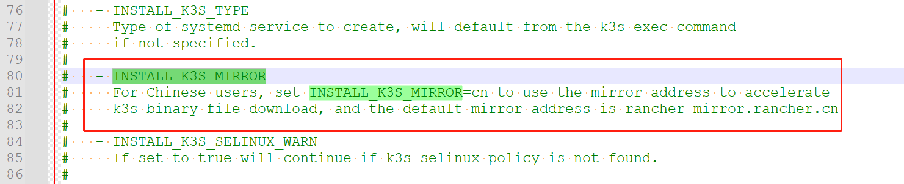
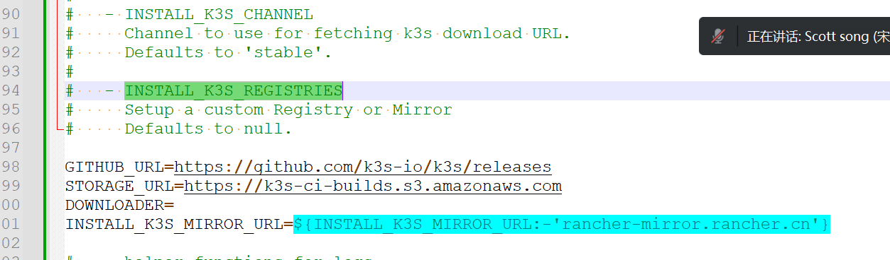

#### K3S安装脚本源码鉴赏

* 背景
  如题

* 安装源
  官方地址：https://get.k3s.io
  官方给的国内地址：https://rancher-mirror.rancher.cn/k3s/k3s-install.sh
  阿里源地址：https://rancher-mirror.oss-cn-beijing.aliyuncs.com/k3s/k3s-install.sh
  官方源慢！官方给的国内地址有一段时间没法用，需要留意！

* 说明
  以官方源为基础，其他源的脚本稍有不同，行数更多些，最后比较多出的部分

* 脚本开头
  set --help查看参数详细意义
  -e 非0就退出
  -o noglob 停用文件通配符

  ```bash
  set -e
        -e  Exit immediately if a command exits with a non-zero status.
  set -o noglob
  ```

  

  验证禁用文件通配符

  

* 脚本注释
  注释说明比较详细，说明了用法、示例及环境变量部分
  环境变量里有部分说明了很多语法格式是有同样效果的，所以见到不同的用法不要诧异，比如
  

* 脚本正文1

  ```bash
  # K3S GITHUB 发布地址
  GITHUB_URL=https://github.com/k3s-io/k3s/releases
  # K3S 亚马逊仓库地址
  STORAGE_URL=https://k3s-ci-builds.s3.amazonaws.com
  # 下载器默认为空
  DOWNLOADER=
  
  # info warn fatal 三个函数 info是标准输出 warn是标准输出和标准错误 fatal标准输出和标准错误且退出
  # --- helper functions for logs ---
  info()
  {
      echo '[INFO] ' "$@"
  }
  warn()
  {
      echo '[WARN] ' "$@" >&2
  }
  fatal()
  {
      echo '[ERROR] ' "$@" >&2
      exit 1
  }
  # 批评下函数格式不统一 下边的函数大括号风格改变
  ```

* 脚本正文2

  ```bash
  # return不带参数时，则会返回函数体中最后一个命令的返回值。
  # 判断操作系统是systemd还是openrc 判断出来给个为true的标签
  # --- fatal if no systemd or openrc ---
  verify_system() {
      if [ -x /sbin/openrc-run ]; then
          HAS_OPENRC=true
          return
      fi
      if [ -x /bin/systemctl ] || type systemctl > /dev/null 2>&1; then
          HAS_SYSTEMD=true
          return
      fi
      fatal 'Can not find systemd or openrc to use as a process supervisor for k3s'
  }
  
  # 给所有的命令参数添加单引号
  # sed替换有三部分 中间用两个分号分开 总共用一个双引号包起来（用单引号的话其中的转义无法处理）
  # sed "s/'/'\\\\''/g"
  # 将单引号' 转换为 '\\'' 实际转为 '\'' 也就是用两个反斜线转义一对单引号
  # sed 中四个反斜线和三个反斜线替换效果相同
  # sed "1s/^/'/;"
  # 在第一行的开头加上单引号 因为是在for循环里单个遍历命令行参数
  # 所以实际效果是在每个命令参数前都加了单引号
  # sed "\$s/\$/'/"
  # 将行尾的回车(printf给的\n) 替换为单引号
  # 反斜线加dollar符 表示开启正则表达式行匹配
  # 参考
  # man sed 
  # https://www.gnu.org/software/sed/manual/html_node/Regular-Expressions.html
  
  # --- add quotes to command arguments ---
  quote() {
      for arg in "$@"; do
          printf '%s\n' "$arg" | sed "s/'/'\\\\''/g;1s/^/'/;\$s/\$/'/"
      done
  }
  
  # ---为带引号的参数添加缩进和尾部斜杠---
  # --- add indentation and trailing slash to quoted args ---
  quote_indent() {
      printf ' \\\n'
      for arg in "$@"; do
          # 参数用%s输出 前部分加tab缩进 后部分加“空格反斜线回车”
          # 三个反斜线转义成一个反斜线 ' \\\n' == ' \n'
          printf '\t%s \\\n' "$(quote "$arg")"
      done
  }
  # ---转义大多数标点字符，引号、正斜杠和空格除外---
  # 实际情况是为以下标点符号前边都加了一个反斜线 
  # \\\1 也就是 \1 也就是匹配到的第一个模式 且在模式前加了一个反斜线 用来给特殊符号转义
  # 那第一个模式是啥 将转义字符去除后长这样 如下图
  # sed -e '	 s/   \(  [][!#$%&()*;<=>?\_`{|}]  \)  /  \\\1   /g;	'
  # 匹配到小括号里的任意字符 命中后在该字符前加个反斜线表示转义
  # --- escape most punctuation characters, except quotes, forward slash, and space ---
  escape() {
      printf '%s' "$@" | sed -e 's/\([][!#$%&()*;<=>?\_`{|}]\)/\\\1/g;'
  }
  
  # 转义双引号
  # --- escape double quotes ---
  escape_dq() {
      # 将双引号替换为反斜线加双引号 也就是转义双引号
      printf '%s' "$@" | sed -e 's/"/\\"/g'
  }
  ```

  man sed 查看sed正则表达说明

  

  脚本正文2sed正则匹配测试验证脚本

  ```bash
  root@mario:~# set -- 123 hahaha 23333 nicaicai \'  \" \$ \# \& 
  root@mario:~# echo $@
  123 hahaha 23333 nicaicai ' " $ # &
  root@mario:~# for arg in "$@"; do  printf '%s\n' "$arg"; done
  123
  hahaha
  23333
  nicaicai
  '
  "
  $
  #
  &
  root@mario:~# for arg in "$@"; do  printf '%s\n' "$arg" | sed "s/'/'\\\\''/g";  done
  123
  hahaha
  23333
  nicaicai
  '\''
  "
  $
  #
  &
  root@mario:~# for arg in "$@"; do  printf '%s\n' "$arg" | sed "s/'/'\\\\''/g; 1s/^/'/;" ;  done
  '123
  'hahaha
  '23333
  'nicaicai
  ''\''
  '"
  '$
  '#
  '&
  root@mario:~# for arg in "$@"; do  printf '%s\n' "$arg" | sed "s/'/'\\\\''/g; 1s/^/'/;\$s/\$/'/" ;  done
  '123'
  'hahaha'
  '23333'
  'nicaicai'
  ''\'''
  '"'
  '$'
  '#'
  '&'
  
  ```

  

  脚本正文2多个反斜线--三个反斜线、四个反斜线
  参考
  https://www.ibm.com/docs/zh/db2/9.7?topic=environments-specifying-rah-db2-all-commands
  https://unix.stackexchange.com/questions/32260/number-of-backslashes-needed-for-escaping-regex-backslash-on-the-command-line

  脚本正文2sed模式1
  

  

* 脚本正文3
  ```bash
  # ---确保 $K3S_URL 为空或以 https:// 开头，否则致命地退出---
  # 改用法的亮点在于用case代替了if判断 case分支判断里支持正则匹配
  # --- ensures $K3S_URL is empty or begins with https://, exiting fatally otherwise ---
  verify_k3s_url() {
      case "${K3S_URL}" in
          "")
              ;;
          https://*)
              ;;
          *)
              fatal "Only https:// URLs are supported for K3S_URL (have ${K3S_URL})"
              ;;
      esac
  }
  
  ```
  
  
  
* 脚本正文4
  ```bash
  # ---定义所需的环境变量---
  # --- define needed environment variables ---
  setup_env() {
      # --- use command args if passed or create default ---
      case "$1" in
          # --- if we only have flags discover if command should be server or agent ---
          (-*|"")  # 如果第一个参数是短横杠开头或者为空 那么是server类型
              if [ -z "${K3S_URL}" ]; then
                  CMD_K3S=server
              else  # 其他情况为agent类型 但是所需的下边这两个变量都没有的话直接fatal
                  if [ -z "${K3S_TOKEN}" ] && [ -z "${K3S_TOKEN_FILE}" ]; then
                      fatal "Defaulted k3s exec command to 'agent' because K3S_URL is defined, but K3S_TOKEN or K3S_TOKEN_FILE is not defined."
                  fi
                  CMD_K3S=agent
              fi
          ;;
          # --- command is provided ---
          (*)  # case默认分支 把第一个参数给CMD_K3S 然后参数左移 后边参数补位到第一个参数
              CMD_K3S=$1
              shift
          ;;
      esac
  
      # 确保下URL字符串合法
      verify_k3s_url
  
      # 将转义完成的位置参数和CMD_K3S拼凑一起给CMD_K3S_EXEC
      CMD_K3S_EXEC="${CMD_K3S}$(quote_indent "$@")"
  
      # k3s服务名 如果给了自定义的服务名那么用自定义的
      # 如果没给 那么看类型 如果是server那么服务名为可k3s 其他情况统统k3s-agent
      # --- use systemd name if defined or create default ---
      if [ -n "${INSTALL_K3S_NAME}" ]; then
          SYSTEM_NAME=k3s-${INSTALL_K3S_NAME}
      else
          if [ "${CMD_K3S}" = server ]; then
              SYSTEM_NAME=k3s
          else
              SYSTEM_NAME=k3s-${CMD_K3S}
          fi
      fi
  
      # 检查服务名里的非法字符
      # 如果服务名里有sed方括号里出现的任何一个或多个字符 那么将这些字符统统替换为符号“^”
      # 然后对比替换前后的字符串是否相同
      # 如果不同 那么将非法字符串中除了“^”以外的字符换成空格全部fatal出来
      # --- check for invalid characters in system name ---
      valid_chars=$(printf '%s' "${SYSTEM_NAME}" | sed -e 's/[][!#$%&()*;<=>?\_`{|}/[:space:]]/^/g;' )
      if [ "${SYSTEM_NAME}" != "${valid_chars}"  ]; then
          # 将上箭头“^”以外的字符统统替换为空格
          # 参考：https://www.gnu.org/software/sed/manual/sed.html
          # ‘^’
          # represents the characters not in the list. If you want to make the ‘^’ character a list item, place it anywhere but first.
          # 表示不在列表中的字符。如果要使“^”字符成为列表项，请将其放在除第一个字符之外的任何位置。
          # 所以第一个上箭头表示格式 第二个上箭头才是匹配字符关键字
          invalid_chars=$(printf '%s' "${valid_chars}" | sed -e 's/[^^]/ /g')
          fatal "Invalid characters for system name:
              ${SYSTEM_NAME}
              ${invalid_chars}"
      fi
  
      # --- 如果我们还没有根---，请使用 sudo
      # 默认赋值为sudo 如果已经是root那么赋值为空字符串
      # --- use sudo if we are not already root ---
      SUDO=sudo
      if [ $(id -u) -eq 0 ]; then
          SUDO=
      fi
  
      # --- 使用 systemd 类型如果已定义或创建 默认为notify---
      # --- use systemd type if defined or create default ---
      if [ -n "${INSTALL_K3S_TYPE}" ]; then
          SYSTEMD_TYPE=${INSTALL_K3S_TYPE}
      else
          SYSTEMD_TYPE=notify
      fi
  
      # k3s二进制文件目录
      # --- use binary install directory if defined or create default ---
      if [ -n "${INSTALL_K3S_BIN_DIR}" ]; then
          BIN_DIR=${INSTALL_K3S_BIN_DIR}
      else
          # --- use /usr/local/bin if root can write to it, otherwise use /opt/bin if it exists
          BIN_DIR=/usr/local/bin
          if ! $SUDO sh -c "touch ${BIN_DIR}/k3s-ro-test && rm -rf ${BIN_DIR}/k3s-ro-test"; then
              if [ -d /opt/bin ]; then
                  BIN_DIR=/opt/bin
              fi
          fi
      fi
  
      # k3s服务目录
      # --- use systemd directory if defined or create default ---
      if [ -n "${INSTALL_K3S_SYSTEMD_DIR}" ]; then
          SYSTEMD_DIR="${INSTALL_K3S_SYSTEMD_DIR}"
      else
          SYSTEMD_DIR=/etc/systemd/system
      fi
  
      #k3s服务相关文件名
      # --- set related files from system name ---
      SERVICE_K3S=${SYSTEM_NAME}.service
      UNINSTALL_K3S_SH=${UNINSTALL_K3S_SH:-${BIN_DIR}/${SYSTEM_NAME}-uninstall.sh}
      KILLALL_K3S_SH=${KILLALL_K3S_SH:-${BIN_DIR}/k3s-killall.sh}
  
      # 根据systemd/openrc类型 使用对应的service及变量
      # --- use service or environment location depending on systemd/openrc ---
      if [ "${HAS_SYSTEMD}" = true ]; then
          FILE_K3S_SERVICE=${SYSTEMD_DIR}/${SERVICE_K3S}
          FILE_K3S_ENV=${SYSTEMD_DIR}/${SERVICE_K3S}.env
      elif [ "${HAS_OPENRC}" = true ]; then
          $SUDO mkdir -p /etc/rancher/k3s
          FILE_K3S_SERVICE=/etc/init.d/${SYSTEM_NAME}
          FILE_K3S_ENV=/etc/rancher/k3s/${SYSTEM_NAME}.env
      fi
  
      # 获取当前已经安装的k3s的exe及config的哈希值
      # get_installed_hashes 函数接下来分析
      # --- get hash of config & exec for currently installed k3s ---
      PRE_INSTALL_HASHES=$(get_installed_hashes)
  
      # 如果改变量为true那么跳过下载--也就是离线安装的情况
      # --- if bin directory is read only skip download ---
      if [ "${INSTALL_K3S_BIN_DIR_READ_ONLY}" = true ]; then
          INSTALL_K3S_SKIP_DOWNLOAD=true
      fi
  
      # 设置channel相关值 默认URL及默认版本为stable稳定版
      # --- setup channel values
      INSTALL_K3S_CHANNEL_URL=${INSTALL_K3S_CHANNEL_URL:-'https://update.k3s.io/v1-release/channels'}
      INSTALL_K3S_CHANNEL=${INSTALL_K3S_CHANNEL:-'stable'}
  }
  
  ```
  
* 脚本正文5
  ```bash
  # ---检查是否设置了跳过下载环境变量---
  # --- check if skip download environment variable set ---
  can_skip_download_binary() {
      if [ "${INSTALL_K3S_SKIP_DOWNLOAD}" != true ] && [ "${INSTALL_K3S_SKIP_DOWNLOAD}" != binary ]; then
          return 1
      fi
  }
  
  # 跳过下载selinux
  can_skip_download_selinux() {                                                        
      if [ "${INSTALL_K3S_SKIP_DOWNLOAD}" != true ] && [ "${INSTALL_K3S_SKIP_DOWNLOAD}" != selinux ]; then 
          return 1                                                                     
      fi                                                                               
  }  
  
  # ---验证是否安装了可执行的 k3s 二进制文件---
  # --- verify an executable k3s binary is installed ---
  verify_k3s_is_executable() {
      if [ ! -x ${BIN_DIR}/k3s ]; then
          fatal "Executable k3s binary not found at ${BIN_DIR}/k3s"
      fi
  }
  
  # ---设置架构类型和后缀，如果架构不支持，则fatal---
  # --- set arch and suffix, fatal if architecture not supported ---
  setup_verify_arch() {
      if [ -z "$ARCH" ]; then
          ARCH=$(uname -m)
      fi
      case $ARCH in
          amd64)
              ARCH=amd64
              SUFFIX=
              ;;
          x86_64)
              ARCH=amd64
              SUFFIX=
              ;;
          arm64)
              ARCH=arm64
              SUFFIX=-${ARCH}
              ;;
          s390x)
              ARCH=s390x
              SUFFIX=-${ARCH}
              ;;
          aarch64)
              ARCH=arm64
              SUFFIX=-${ARCH}
              ;;
          arm*)
              ARCH=arm
              SUFFIX=-${ARCH}hf
              ;;
          *)  # 默认分支fatal
              fatal "Unsupported architecture $ARCH"
      esac
  }
  
  # ---验证是否存在网络下载器可执行---
  # --- verify existence of network downloader executable ---
  verify_downloader() {
      # Return failure if it doesn't exist or is no executable
      [ -x "$(command -v $1)" ] || return 1
  
      # Set verified executable as our downloader program and return success
      DOWNLOADER=$1
      return 0
  }
  
  ```
  
  
  
* 脚本正文6
  ```bash
  # ---创建临时目录并在完成后清理---
  # cleanup函数内用到了trap捕捉异常 并且外层又用trap捕捉了一把cleanup函数
  # --- create temporary directory and cleanup when done ---
  setup_tmp() {
      TMP_DIR=$(mktemp -d -t k3s-install.XXXXXXXXXX)
      TMP_HASH=${TMP_DIR}/k3s.hash
      TMP_BIN=${TMP_DIR}/k3s.bin
      cleanup() {
          code=$?
          set +e
          trap - EXIT  # 捕捉EXIT
          rm -rf ${TMP_DIR}
          exit $code
      }
      trap cleanup INT EXIT  # 捕捉INT EXIT
  }
  
  # 使用想要的k3s版本 也就是自定义k3s版本 版本号一般通过k3s github release页获取
  # --- use desired k3s version if defined or find version from channel ---
  get_release_version() {
      if [ -n "${INSTALL_K3S_COMMIT}" ]; then
          VERSION_K3S="commit ${INSTALL_K3S_COMMIT}"
      elif [ -n "${INSTALL_K3S_VERSION}" ]; then
          VERSION_K3S=${INSTALL_K3S_VERSION}
      else
          info "Finding release for channel ${INSTALL_K3S_CHANNEL}"
          version_url="${INSTALL_K3S_CHANNEL_URL}/${INSTALL_K3S_CHANNEL}"
          case $DOWNLOADER in  # 两种下载器 curl和wget
              curl)
                  VERSION_K3S=$(curl -w '%{url_effective}' -L -s -S ${version_url} -o /dev/null | sed -e 's|.*/||')
                  # sed怪又来了 这次因为要匹配的字符串里有正斜线 所以采用了竖线作为分隔符
                  # sed 's|XXX||'  第二个分隔符采用了两个竖线 跟第一个分隔符竟然不同
                  # 上述公式等效于sed 's|XXX||1' 也就是模式1 匹配到的模式全部替换为空 
                  # 也就是删除 .*/ 
                  # 注意开头的点表示匹配除换行符之外的任意单个字符 
                  # 也就是匹配 Xxxxxx/ 全部删除
                  # https://github.com/k3s-io/k3s/releases/tag/v1.27.5+k3s1
                  # ===>v1.27.5+k3s1
                  # 注意正则匹配开头的点不能删除
                  # 将“.”和“*”组合起来能够匹配任意数量的任意字符
                  # 将分隔符竖线改为@符号 效果等同 改为#符号 效果依然相同
                  # 小结 sed分隔符前一后二 不带数字 一般表示删除、点星搭配，正则匹配
                  ;;
              wget)
                  VERSION_K3S=$(wget -SqO /dev/null ${version_url} 2>&1 | grep -i Location | sed -e 's|.*/||')
                  ;;
              *)
                  fatal "Incorrect downloader executable '$DOWNLOADER'"
                  ;;
          esac
      fi
      info "Using ${VERSION_K3S} as release"
  }
  
  # --- get k3s-selinux version ---
  get_k3s_selinux_version() {
      available_version="k3s-selinux-1.2-2.${rpm_target}.noarch.rpm"
      info "Finding available k3s-selinux versions"
      
      # run verify_downloader in case it binary installation was skipped
      verify_downloader curl || verify_downloader wget || fatal 'Can not find curl or wget for downloading files'
  
      case $DOWNLOADER in
          curl)
              DOWNLOADER_OPTS="-s"
              ;;
          wget)
              DOWNLOADER_OPTS="-q -O -"
              ;;
          *)
              fatal "Incorrect downloader executable '$DOWNLOADER'"
              ;;
      esac
      # 循环三遍 也就是重试三次 主要是处理网络访问异常引起的变量赋值异常
      for i in {1..3}; do
          set +e
          if [ "${rpm_channel}" = "testing" ]; then
              version=$(timeout 5 ${DOWNLOADER} ${DOWNLOADER_OPTS} https://api.github.com/repos/k3s-io/k3s-selinux/releases |  grep browser_download_url | awk '{ print $2 }' | grep -oE "[^\/]+${rpm_target}\.noarch\.rpm" | head -n 1)
          else
              version=$(timeout 5 ${DOWNLOADER} ${DOWNLOADER_OPTS} https://api.github.com/repos/k3s-io/k3s-selinux/releases/latest |  grep browser_download_url | awk '{ print $2 }' | grep -oE "[^\/]+${rpm_target}\.noarch\.rpm")
          fi
          set -e
          if [ "${version}" != "" ]; then
              break
          fi
          sleep 1
      done
      if [ "${version}" == "" ]; then
          warn "Failed to get available versions of k3s-selinux..defaulting to ${available_version}"
          return
      fi
      available_version=${version}
  }
  ```
  
  
  
* 脚本正文7
  ```bash
  
  # --- download from github url ---
  download() {
      # 下载参数校验
      [ $# -eq 2 ] || fatal 'download needs exactly 2 arguments'
  
      case $DOWNLOADER in
          curl)
              curl -o $1 -sfL $2
              ;;
          wget)
              wget -qO $1 $2
              ;;
          *)
              fatal "Incorrect executable '$DOWNLOADER'"
              ;;
      esac
  
      # Abort if download command failed
      [ $? -eq 0 ] || fatal 'Download failed'
  }
  
  # --- download hash from github url ---
  download_hash() {
      if [ -n "${INSTALL_K3S_COMMIT}" ]; then
          HASH_URL=${STORAGE_URL}/k3s${SUFFIX}-${INSTALL_K3S_COMMIT}.sha256sum
      else
          HASH_URL=${GITHUB_URL}/download/${VERSION_K3S}/sha256sum-${ARCH}.txt
      fi
      info "Downloading hash ${HASH_URL}"
      download ${TMP_HASH} ${HASH_URL}
      HASH_EXPECTED=$(grep " k3s${SUFFIX}$" ${TMP_HASH})
      HASH_EXPECTED=${HASH_EXPECTED%%[[:blank:]]*}
  }
  
  # --- check hash against installed version ---
  installed_hash_matches() {
      if [ -x ${BIN_DIR}/k3s ]; then
          HASH_INSTALLED=$(sha256sum ${BIN_DIR}/k3s)
          HASH_INSTALLED=${HASH_INSTALLED%%[[:blank:]]*}
          # 花括号扩展 后缀匹配最长删除 匹配的是空格星号  也就是删除空格以后所有部分
          if [ "${HASH_EXPECTED}" = "${HASH_INSTALLED}" ]; then
              return
          fi
      fi
      return 1
  }
  
  # --- download binary from github url ---
  download_binary() {
      if [ -n "${INSTALL_K3S_COMMIT}" ]; then
          BIN_URL=${STORAGE_URL}/k3s${SUFFIX}-${INSTALL_K3S_COMMIT}
      else
          BIN_URL=${GITHUB_URL}/download/${VERSION_K3S}/k3s${SUFFIX}
      fi
      info "Downloading binary ${BIN_URL}"
      download ${TMP_BIN} ${BIN_URL}
  }
  
  # --- verify downloaded binary hash ---
  verify_binary() {
      info "Verifying binary download"
      HASH_BIN=$(sha256sum ${TMP_BIN})
      HASH_BIN=${HASH_BIN%%[[:blank:]]*}
      if [ "${HASH_EXPECTED}" != "${HASH_BIN}" ]; then
          fatal "Download sha256 does not match ${HASH_EXPECTED}, got ${HASH_BIN}"
      fi
  }
  
  ```
  
  
  
* 脚本正文8
  ```bash
  # --- setup permissions and move binary to system directory ---
  setup_binary() {
      chmod 755 ${TMP_BIN}
      info "Installing k3s to ${BIN_DIR}/k3s"
      $SUDO chown root:root ${TMP_BIN}
      $SUDO mv -f ${TMP_BIN} ${BIN_DIR}/k3s
  }
  
  # --- setup selinux policy ---
  setup_selinux() {
      case ${INSTALL_K3S_CHANNEL} in 
          *testing)
              rpm_channel=testing
              ;;
          *latest)
              rpm_channel=latest
              ;;
          *)
              rpm_channel=stable
              ;;
      esac
  
      rpm_site="rpm.rancher.io"
      if [ "${rpm_channel}" = "testing" ]; then
          rpm_site="rpm-testing.rancher.io"
      fi
  
      [ -r /etc/os-release ] && . /etc/os-release
      if [ `expr "${ID_LIKE}" : ".*suse.*"` != 0 ]; then
          rpm_target=sle
          rpm_site_infix=microos
          package_installer=zypper
          if [ "${ID_LIKE:-}" = suse ] && [ "${VARIANT_ID:-}" = sle-micro ]; then
              rpm_target=sle
              rpm_site_infix=slemicro
              package_installer=zypper
          fi
      elif [ "${ID_LIKE:-}" = coreos ] || [ "${VARIANT_ID:-}" = coreos ]; then
          rpm_target=coreos
          rpm_site_infix=coreos
          package_installer=rpm-ostree
      elif [ "${VERSION_ID%%.*}" = "7" ]; then
          rpm_target=el7
          rpm_site_infix=centos/7
          package_installer=yum
      elif [ "${VERSION_ID%%.*}" = "8" ] || [ "${VERSION_ID%%.*}" -gt "36" ]; then
          rpm_target=el8
          rpm_site_infix=centos/8
          package_installer=yum
      else
          rpm_target=el9
          rpm_site_infix=centos/9
          package_installer=yum
      fi
  
      if [ "${package_installer}" = "rpm-ostree" ] && [ -x /bin/yum ]; then
          package_installer=yum
      fi
  
      if [ "${package_installer}" = "yum" ] && [ -x /usr/bin/dnf ]; then
          package_installer=dnf
      fi
  
      policy_hint="please install:
      ${package_installer} install -y container-selinux
      ${package_installer} install -y https://${rpm_site}/k3s/${rpm_channel}/common/${rpm_site_infix}/noarch/${available_version}
  "
  
      if [ "$INSTALL_K3S_SKIP_SELINUX_RPM" = true ] || can_skip_download_selinux || [ ! -d /usr/share/selinux ]; then
          info "Skipping installation of SELinux RPM"
      else
          get_k3s_selinux_version
          install_selinux_rpm ${rpm_site} ${rpm_channel} ${rpm_target} ${rpm_site_infix}
      fi
  
      policy_error=fatal
      if [ "$INSTALL_K3S_SELINUX_WARN" = true ] || [ "${ID_LIKE:-}" = coreos ] || [ "${VARIANT_ID:-}" = coreos ]; then
          policy_error=warn
      fi
  
      if ! $SUDO chcon -u system_u -r object_r -t container_runtime_exec_t ${BIN_DIR}/k3s >/dev/null 2>&1; then
          if $SUDO grep '^\s*SELINUX=enforcing' /etc/selinux/config >/dev/null 2>&1; then
              $policy_error "Failed to apply container_runtime_exec_t to ${BIN_DIR}/k3s, ${policy_hint}"
          fi
      elif [ ! -f /usr/share/selinux/packages/k3s.pp ]; then
          if [ -x /usr/sbin/transactional-update ] || [ "${ID_LIKE:-}" = coreos ] || [ "${VARIANT_ID:-}" = coreos ]; then
              warn "Please reboot your machine to activate the changes and avoid data loss."
          else
              $policy_error "Failed to find the k3s-selinux policy, ${policy_hint}"
          fi
      fi
  }
  
  # 安装selinux安装包
  install_selinux_rpm() {
      if [ -r /etc/redhat-release ] || [ -r /etc/centos-release ] || [ -r /etc/oracle-release ] || [ -r /etc/fedora-release ] || [ "${ID_LIKE%%[ ]*}" = "suse" ]; then
          repodir=/etc/yum.repos.d
          if [ -d /etc/zypp/repos.d ]; then
              repodir=/etc/zypp/repos.d
          fi
          set +o noglob  # 临时打开了文件名通配符匹配 下面的删除用到了通配符匹配
          $SUDO rm -f ${repodir}/rancher-k3s-common*.repo
          set -o noglob  # 又关闭了
          if [ -r /etc/redhat-release ] && [ "${3}" = "el7" ]; then
              $SUDO yum install -y yum-utils
              $SUDO yum-config-manager --enable rhel-7-server-extras-rpms
          fi
          $SUDO tee ${repodir}/rancher-k3s-common.repo >/dev/null << EOF
  [rancher-k3s-common-${2}]
  name=Rancher K3s Common (${2})
  baseurl=https://${1}/k3s/${2}/common/${4}/noarch
  enabled=1
  gpgcheck=1
  repo_gpgcheck=0
  gpgkey=https://${1}/public.key
  EOF
          case ${3} in
          sle)
              rpm_installer="zypper --gpg-auto-import-keys"
              if [ "${TRANSACTIONAL_UPDATE=false}" != "true" ] && [ -x /usr/sbin/transactional-update ]; then
                  transactional_update_run="transactional-update --no-selfupdate -d run"
                  rpm_installer="transactional-update --no-selfupdate -d run ${rpm_installer}"
                  : "${INSTALL_K3S_SKIP_START:=true}"
              fi
              # create the /var/lib/rpm-state in SLE systems to fix the prein selinux macro
              ${transactional_update_run} mkdir -p /var/lib/rpm-state
              ;;
          coreos)
              rpm_installer="rpm-ostree --idempotent"
              # rpm_install_extra_args="--apply-live"
              : "${INSTALL_K3S_SKIP_START:=true}"
              ;;
          *)
              rpm_installer="yum"
              ;;
          esac
          if [ "${rpm_installer}" = "yum" ] && [ -x /usr/bin/dnf ]; then
              rpm_installer=dnf
          fi
  	    if rpm -q --quiet k3s-selinux; then 
              # remove k3s-selinux module before upgrade to allow container-selinux to upgrade safely
              if check_available_upgrades container-selinux ${3} && check_available_upgrades k3s-selinux ${3}; then
                  MODULE_PRIORITY=$($SUDO semodule --list=full | grep k3s | cut -f1 -d" ")
                  if [ -n "${MODULE_PRIORITY}" ]; then
                      $SUDO semodule -X $MODULE_PRIORITY -r k3s || true
                  fi
              fi
          fi
          # shellcheck disable=SC2086
          $SUDO ${rpm_installer} install -y "k3s-selinux"
      fi
      return
  }
  
  ```
  
  
  
* 脚本正文9
  ```bash
  # 检查可用的升级版本
  check_available_upgrades() {
      set +e  # 临时关闭非零退出
      case ${2} in
          sle)
              available_upgrades=$($SUDO zypper -q -t -s 11 se -s -u --type package $1 | tail -n 1 | grep -v "No matching" | awk '{print $3}')
              ;;
          coreos)
              # currently rpm-ostree does not support search functionality https://github.com/coreos/rpm-ostree/issues/1877
              ;;
          *)
              available_upgrades=$($SUDO yum -q --refresh list $1 --upgrades | tail -n 1 | awk '{print $2}')
              ;;
      esac
      set -e  # 打开非零退出
      if [ -n "${available_upgrades}" ]; then
          return 0
      fi
      return 1
  }
  
  # 下载和校验的核心函数 里边调用了其他函数
  # --- download and verify k3s ---
  download_and_verify() {
      if can_skip_download_binary; then
         info 'Skipping k3s download and verify'
         verify_k3s_is_executable
         return
      fi
  
      setup_verify_arch
      verify_downloader curl || verify_downloader wget || fatal 'Can not find curl or wget for downloading files'
      setup_tmp
      get_release_version
      download_hash
  
      if installed_hash_matches; then
          info 'Skipping binary downloaded, installed k3s matches hash'
          return
      fi
  
      download_binary
      verify_binary
      setup_binary
  }
  
  ```
  
  
  
* 脚本正文10
  ```bash
  # ---添加其他实用程序链接---
  # --- add additional utility links ---
  create_symlinks() {
      [ "${INSTALL_K3S_BIN_DIR_READ_ONLY}" = true ] && return
      [ "${INSTALL_K3S_SYMLINK}" = skip ] && return
  
      for cmd in kubectl crictl ctr; do
          if [ ! -e ${BIN_DIR}/${cmd} ] || [ "${INSTALL_K3S_SYMLINK}" = force ]; then
              which_cmd=$(command -v ${cmd} 2>/dev/null || true)
              if [ -z "${which_cmd}" ] || [ "${INSTALL_K3S_SYMLINK}" = force ]; then
                  info "Creating ${BIN_DIR}/${cmd} symlink to k3s"
                  $SUDO ln -sf k3s ${BIN_DIR}/${cmd}
              else
                  info "Skipping ${BIN_DIR}/${cmd} symlink to k3s, command exists in PATH at ${which_cmd}"
              fi
          else
              info "Skipping ${BIN_DIR}/${cmd} symlink to k3s, already exists"
          fi
      done
  }
  
  # 创建killall脚本
  # --- create killall script ---
  create_killall() {
      [ "${INSTALL_K3S_BIN_DIR_READ_ONLY}" = true ] && return
      info "Creating killall script ${KILLALL_K3S_SH}"
      $SUDO tee ${KILLALL_K3S_SH} >/dev/null << \EOF
  #!/bin/sh
  # 要么root执行 要么sudo执行
  [ $(id -u) -eq 0 ] || exec sudo $0 $@
  
  # 遍历 /var/lib/rancher/k3s/data/ 目录下叫bin的子目录
  # ls -ld /var/lib/rancher/k3s/data/**/bin/ 可以展示
  # 实测一个星号效果相同
  for bin in /var/lib/rancher/k3s/data/**/bin/; do
      [ -d $bin ] && export PATH=$PATH:$bin:$bin/aux
  done
  
  set -x
  
  for service in /etc/systemd/system/k3s*.service; do
      [ -s $service ] && systemctl stop $(basename $service)
  done
  
  for service in /etc/init.d/k3s*; do
      [ -x $service ] && $service stop
  done
  
  pschildren() {
      ps -e -o ppid= -o pid= | \
      sed -e 's/^\s*//g; s/\s\s*/\t/g;' | \
      grep -w "^$1" | \
      cut -f2
  }
  
  pstree() {
      for pid in $@; do
          echo $pid
          for child in $(pschildren $pid); do
              pstree $child
          done
      done
  }
  
  killtree() {
      kill -9 $(
          { set +x; } 2>/dev/null;
          pstree $@;
          set -x;
      ) 2>/dev/null
  }
  
  remove_interfaces() {
      # Delete network interface(s) that match 'master cni0'
      ip link show 2>/dev/null | grep 'master cni0' | while read ignore iface ignore; do
          iface=${iface%%@*}
          [ -z "$iface" ] || ip link delete $iface
      done
  
      # Delete cni related interfaces
      ip link delete cni0
      ip link delete flannel.1
      ip link delete flannel-v6.1
      ip link delete kube-ipvs0
      ip link delete flannel-wg
      ip link delete flannel-wg-v6
  
      # Restart tailscale
      if [ -n "$(command -v tailscale)" ]; then
          tailscale set --advertise-routes=
      fi
  }
  
  getshims() {
      ps -e -o pid= -o args= | sed -e 's/^ *//; s/\s\s*/\t/;' | grep -w 'k3s/data/[^/]*/bin/containerd-shim' | cut -f1
  }
  
  killtree $({ set +x; } 2>/dev/null; getshims; set -x)
  
  do_unmount_and_remove() {
      set +x
      while read -r _ path _; do
          case "$path" in $1*) echo "$path" ;; esac
      done < /proc/self/mounts | sort -r | xargs -r -t -n 1 sh -c 'umount "$0" && rm -rf "$0"'
      set -x
  }
  
  do_unmount_and_remove '/run/k3s'
  do_unmount_and_remove '/var/lib/rancher/k3s'
  do_unmount_and_remove '/var/lib/kubelet/pods'
  do_unmount_and_remove '/var/lib/kubelet/plugins'
  do_unmount_and_remove '/run/netns/cni-'
  
  # Remove CNI namespaces
  ip netns show 2>/dev/null | grep cni- | xargs -r -t -n 1 ip netns delete
  
  remove_interfaces
  
  rm -rf /var/lib/cni/
  iptables-save | grep -v KUBE- | grep -v CNI- | grep -iv flannel | iptables-restore
  ip6tables-save | grep -v KUBE- | grep -v CNI- | grep -iv flannel | ip6tables-restore
  EOF
      $SUDO chmod 755 ${KILLALL_K3S_SH}
      $SUDO chown root:root ${KILLALL_K3S_SH}
  }
  
  # 创建卸载脚本
  # --- create uninstall script ---
  create_uninstall() {
      [ "${INSTALL_K3S_BIN_DIR_READ_ONLY}" = true ] && return
      info "Creating uninstall script ${UNINSTALL_K3S_SH}"
      $SUDO tee ${UNINSTALL_K3S_SH} >/dev/null << EOF
  #!/bin/sh
  set -x
  [ \$(id -u) -eq 0 ] || exec sudo \$0 \$@
  
  ${KILLALL_K3S_SH}
  
  if command -v systemctl; then
      systemctl disable ${SYSTEM_NAME}
      systemctl reset-failed ${SYSTEM_NAME}
      systemctl daemon-reload
  fi
  if command -v rc-update; then
      rc-update delete ${SYSTEM_NAME} default
  fi
  
  rm -f ${FILE_K3S_SERVICE}
  rm -f ${FILE_K3S_ENV}
  
  remove_uninstall() {
      rm -f ${UNINSTALL_K3S_SH}
  }
  trap remove_uninstall EXIT
  
  if (ls ${SYSTEMD_DIR}/k3s*.service || ls /etc/init.d/k3s*) >/dev/null 2>&1; then
      set +x; echo 'Additional k3s services installed, skipping uninstall of k3s'; set -x
      exit
  fi
  
  for cmd in kubectl crictl ctr; do
      if [ -L ${BIN_DIR}/\$cmd ]; then
          rm -f ${BIN_DIR}/\$cmd
      fi
  done
  
  rm -rf /etc/rancher/k3s
  rm -rf /run/k3s
  rm -rf /run/flannel
  rm -rf /var/lib/rancher/k3s
  rm -rf /var/lib/kubelet
  rm -f ${BIN_DIR}/k3s
  rm -f ${KILLALL_K3S_SH}
  
  if type yum >/dev/null 2>&1; then
      yum remove -y k3s-selinux
      rm -f /etc/yum.repos.d/rancher-k3s-common*.repo
  elif type rpm-ostree >/dev/null 2>&1; then
      rpm-ostree uninstall k3s-selinux
      rm -f /etc/yum.repos.d/rancher-k3s-common*.repo
  elif type zypper >/dev/null 2>&1; then
      uninstall_cmd="zypper remove -y k3s-selinux"
      if [ "\${TRANSACTIONAL_UPDATE=false}" != "true" ] && [ -x /usr/sbin/transactional-update ]; then
          uninstall_cmd="transactional-update --no-selfupdate -d run \$uninstall_cmd"
      fi
      \$uninstall_cmd
      rm -f /etc/zypp/repos.d/rancher-k3s-common*.repo
  fi
  EOF
      $SUDO chmod 755 ${UNINSTALL_K3S_SH}
      $SUDO chown root:root ${UNINSTALL_K3S_SH}
  }
  
  ```
  
  
  
* 正文脚本11
  ```bash
  
  # --- disable current service if loaded --
  systemd_disable() {
      $SUDO systemctl disable ${SYSTEM_NAME} >/dev/null 2>&1 || true
      $SUDO rm -f /etc/systemd/system/${SERVICE_K3S} || true
      $SUDO rm -f /etc/systemd/system/${SERVICE_K3S}.env || true
  }
  
  # --- capture current env and create file containing k3s_ variables ---
  create_env_file() {
      info "env: Creating environment file ${FILE_K3S_ENV}"
      $SUDO touch ${FILE_K3S_ENV}
      $SUDO chmod 0600 ${FILE_K3S_ENV}
      sh -c export | while read x v; do echo $v; done | grep -E '^(K3S|CONTAINERD)_' | $SUDO tee ${FILE_K3S_ENV} >/dev/null
      sh -c export | while read x v; do echo $v; done | grep -Ei '^(NO|HTTP|HTTPS)_PROXY' | $SUDO tee -a ${FILE_K3S_ENV} >/dev/null
  }
  
  # --- write systemd service file ---
  create_systemd_service_file() {
      info "systemd: Creating service file ${FILE_K3S_SERVICE}"
      $SUDO tee ${FILE_K3S_SERVICE} >/dev/null << EOF
  [Unit]
  Description=Lightweight Kubernetes
  Documentation=https://k3s.io
  Wants=network-online.target
  After=network-online.target
  
  [Install]
  WantedBy=multi-user.target
  
  [Service]
  Type=${SYSTEMD_TYPE}
  EnvironmentFile=-/etc/default/%N
  EnvironmentFile=-/etc/sysconfig/%N
  EnvironmentFile=-${FILE_K3S_ENV}
  KillMode=process
  Delegate=yes
  # Having non-zero Limit*s causes performance problems due to accounting overhead
  # in the kernel. We recommend using cgroups to do container-local accounting.
  LimitNOFILE=1048576
  LimitNPROC=infinity
  LimitCORE=infinity
  TasksMax=infinity
  TimeoutStartSec=0
  Restart=always
  RestartSec=5s
  ExecStartPre=/bin/sh -xc '! /usr/bin/systemctl is-enabled --quiet nm-cloud-setup.service'
  ExecStartPre=-/sbin/modprobe br_netfilter
  ExecStartPre=-/sbin/modprobe overlay
  ExecStart=${BIN_DIR}/k3s \\
      ${CMD_K3S_EXEC}
  
  EOF
  }
  
  # --- write openrc service file ---
  create_openrc_service_file() {
      LOG_FILE=/var/log/${SYSTEM_NAME}.log
  
      info "openrc: Creating service file ${FILE_K3S_SERVICE}"
      $SUDO tee ${FILE_K3S_SERVICE} >/dev/null << EOF
  #!/sbin/openrc-run
  
  depend() {
      after network-online
      want cgroups
  }
  
  start_pre() {
      rm -f /tmp/k3s.*
  }
  
  supervisor=supervise-daemon
  name=${SYSTEM_NAME}
  command="${BIN_DIR}/k3s"
  command_args="$(escape_dq "${CMD_K3S_EXEC}")
      >>${LOG_FILE} 2>&1"
  
  output_log=${LOG_FILE}
  error_log=${LOG_FILE}
  
  pidfile="/var/run/${SYSTEM_NAME}.pid"
  respawn_delay=5
  respawn_max=0
  
  set -o allexport
  if [ -f /etc/environment ]; then . /etc/environment; fi
  if [ -f ${FILE_K3S_ENV} ]; then . ${FILE_K3S_ENV}; fi
  set +o allexport
  EOF
      $SUDO chmod 0755 ${FILE_K3S_SERVICE}
  
      $SUDO tee /etc/logrotate.d/${SYSTEM_NAME} >/dev/null << EOF
  ${LOG_FILE} {
  	missingok
  	notifempty
  	copytruncate
  }
  EOF
  }
  
  # --- write systemd or openrc service file ---
  create_service_file() {
      [ "${HAS_SYSTEMD}" = true ] && create_systemd_service_file
      [ "${HAS_OPENRC}" = true ] && create_openrc_service_file
      return 0
  }
  
  # --- get hashes of the current k3s bin and service files
  get_installed_hashes() {
      $SUDO sha256sum ${BIN_DIR}/k3s ${FILE_K3S_SERVICE} ${FILE_K3S_ENV} 2>&1 || true
  }
  
  # --- enable and start systemd service ---
  systemd_enable() {
      info "systemd: Enabling ${SYSTEM_NAME} unit"
      $SUDO systemctl enable ${FILE_K3S_SERVICE} >/dev/null
      $SUDO systemctl daemon-reload >/dev/null
  }
  
  systemd_start() {
      info "systemd: Starting ${SYSTEM_NAME}"
      $SUDO systemctl restart ${SYSTEM_NAME}
  }
  
  # --- enable and start openrc service ---
  openrc_enable() {
      info "openrc: Enabling ${SYSTEM_NAME} service for default runlevel"
      $SUDO rc-update add ${SYSTEM_NAME} default >/dev/null
  }
  
  openrc_start() {
      info "openrc: Starting ${SYSTEM_NAME}"
      $SUDO ${FILE_K3S_SERVICE} restart
  }
  
  # --- startup systemd or openrc service ---
  service_enable_and_start() {
      if [ -f "/proc/cgroups" ] && [ "$(grep memory /proc/cgroups | while read -r n n n enabled; do echo $enabled; done)" -eq 0 ];
      then
          info 'Failed to find memory cgroup, you may need to add "cgroup_memory=1 cgroup_enable=memory" to your linux cmdline (/boot/cmdline.txt on a Raspberry Pi)'
      fi
  
      [ "${INSTALL_K3S_SKIP_ENABLE}" = true ] && return
  
      [ "${HAS_SYSTEMD}" = true ] && systemd_enable
      [ "${HAS_OPENRC}" = true ] && openrc_enable
  
      [ "${INSTALL_K3S_SKIP_START}" = true ] && return
  
      POST_INSTALL_HASHES=$(get_installed_hashes)
      if [ "${PRE_INSTALL_HASHES}" = "${POST_INSTALL_HASHES}" ] && [ "${INSTALL_K3S_FORCE_RESTART}" != true ]; then
          info 'No change detected so skipping service start'
          return
      fi
  
      if command -v iptables-save 1> /dev/null && command -v iptables-restore 1> /dev/null
      then
  	    $SUDO iptables-save | grep -v KUBE- | grep -iv flannel | $SUDO iptables-restore
      fi
      if command -v ip6tables-save 1> /dev/null && command -v ip6tables-restore 1> /dev/null
      then
  	    $SUDO ip6tables-save | grep -v KUBE- | grep -iv flannel | $SUDO ip6tables-restore
      fi
  
      [ "${HAS_SYSTEMD}" = true ] && systemd_start
      [ "${HAS_OPENRC}" = true ] && openrc_start
      return 0
  }
  ```
  
  
  
* 正文脚本12
  ```bash
  # eval set -- 搭配
  # set -- 把所有的位置参数固定下来 然后eval把他们当做变量再执行一遍
  # --- re-evaluate args to include env command ---
  eval set -- $(escape "${INSTALL_K3S_EXEC}") $(quote "$@")
  
  # 将所有的进程放进一个花括号 花括号不会内视为一个进程 且不会产生子进程
  # --- run the install process --
  {
      verify_system
      setup_env "$@"
      download_and_verify
      setup_selinux
      create_symlinks
      create_killall
      create_uninstall
      systemd_disable
      create_env_file
      create_service_file
      service_enable_and_start
  }
  
  ```
  
  
  
* 小结
  脚本结构清晰，函数结构封装明确，最大的亮点是作者对位置参数的入参校验，比如加单引号、加转义、处理特殊字符等，其中的难点就是sed的各种高级用法，初看肯定懵逼，需要查看sed的man手册，以及sed的正则匹配用法，原作者肯定是个sed高手以及shell高手
  
* 差异--INSTALL_K3S_MIRROR
  
  
  ```bash
  # --- download binary from github url ---
  download_binary() {
      if [ -n "${INSTALL_K3S_COMMIT}" ]; then
          BIN_URL=${STORAGE_URL}/k3s${SUFFIX}-${INSTALL_K3S_COMMIT}
      else
          BIN_URL=${GITHUB_URL}/download/${VERSION_K3S}/k3s${SUFFIX}
      fi
      info "Downloading binary ${BIN_URL}"
      download ${TMP_BIN} ${BIN_URL}
  }
  
  # 下载函数里增加了一个elif 处理镜像源下载
  # --- download binary from github url ---
  download_binary() {
      if [ -n "${INSTALL_K3S_COMMIT}" ]; then
          BIN_URL=${STORAGE_URL}/k3s${SUFFIX}-${INSTALL_K3S_COMMIT}
      elif [ "${INSTALL_K3S_MIRROR}" = cn ]; then
          VERSION_K3S=$( echo ${VERSION_K3S} | sed 's/+/-/g' )
          BIN_URL=${INSTALL_K3S_MIRROR_URL}/k3s/${VERSION_K3S}/k3s${SUFFIX}
      else
          BIN_URL=${GITHUB_URL}/download/${VERSION_K3S}/k3s${SUFFIX}
      fi
      info "Downloading binary ${BIN_URL}"
      download ${TMP_BIN} ${BIN_URL}
  }
  
  # 其他有关INSTALL_K3S_MIRROR的不同
  # setup_env()
      # --- setup channel values
      if [ "${INSTALL_K3S_MIRROR}" = cn ]; then
          INSTALL_K3S_CHANNEL_URL="${INSTALL_K3S_MIRROR_URL}/k3s/channels"
      else
          INSTALL_K3S_CHANNEL_URL=${INSTALL_K3S_CHANNEL_URL:-'https://update.k3s.io/v1-release/channels'}
      fi
      INSTALL_K3S_CHANNEL=${INSTALL_K3S_CHANNEL:-'stable'}
  # get_release_version()
      if [ -n "${INSTALL_K3S_COMMIT}" ]; then
          VERSION_K3S="commit ${INSTALL_K3S_COMMIT}"
      elif [ -n "${INSTALL_K3S_VERSION}" ]; then
          VERSION_K3S=${INSTALL_K3S_VERSION}
      else
          info "Finding release for channel ${INSTALL_K3S_CHANNEL}"
          version_url="${INSTALL_K3S_CHANNEL_URL}/${INSTALL_K3S_CHANNEL}"
          case $DOWNLOADER in
              curl)
                  if [ "${INSTALL_K3S_MIRROR}" = cn ]; then
                      VERSION_K3S=$(curl -s -S ${version_url})
              wget)
                  if [ "${INSTALL_K3S_MIRROR}" = cn ]; then
                      VERSION_K3S=$(wget -qO - ${version_url})
                  else
                      VERSION_K3S=$(wget -SqO /dev/null ${version_url} 2>&1 | grep -i Location | sed -e 's|.*/||')
                  fi
                  ;;
  # download_hash()
      if [ -n "${INSTALL_K3S_COMMIT}" ]; then
          HASH_URL=${STORAGE_URL}/k3s${SUFFIX}-${INSTALL_K3S_COMMIT}.sha256sum
      elif [ "${INSTALL_K3S_MIRROR}" = cn ]; then
          # 将加号换成了建减号
          VERSION_K3S=$( echo ${VERSION_K3S} | sed 's/+/-/g' )
          HASH_URL=${INSTALL_K3S_MIRROR_URL}/k3s/${VERSION_K3S}/sha256sum-${ARCH}.txt
      else
          HASH_URL=${GITHUB_URL}/download/${VERSION_K3S}/sha256sum-${ARCH}.txt
      fi
  ```
  
  
  
* 差异--INSTALL_K3S_REGISTRIES
  最后一个环境变量
  
  
  ```bash
  # 设置自定义仓库或镜像源
  # 这风格差异太大了 很明显源主会用$()做命令替换 而不是反引号
  # 并且用了awk gsub来替换 好突兀
  # 语法 gsub(regexp, replacement [, target])
  # 如果省略 target，则默认使用 $0，即当前处理的输入行文本。
  # 但是作者给target了一个空格，我想他的本意是想给target一个空字符串吧，实际上给个空格还不如不写
  # 按原作者的尿性 即便是替换也会用sed替换 而不是awk
  # 可是我愣是没有看出这个gsub在空格中把斜线转换为斜线的意义在哪，求助
  # 哇靠 原来是把逗号 替换为空格--也就是等效于 awk '{gsub(","," "); print $0}'
  # 如果只是这个简单的替换 笔者会选择花括号扩展
  # “print $0”中的“$0” 也可以省略
  # --- Setup a custom Registry or Mirror
  setup_registry() {
      REGISTRIES_FILE="/etc/rancher/k3s/registries.yaml"
      if [ "${INSTALL_K3S_REGISTRIES}" -a ! -f "$REGISTRIES_FILE" ]; then
          INSTALL_K3S_REGISTRIES=`echo ${INSTALL_K3S_REGISTRIES} | awk '{gsub(/,/," "); print $0}'`
          $SUDO mkdir -p `dirname $REGISTRIES_FILE`
          $SUDO cat >> $REGISTRIES_FILE <<EOF
  mirrors:
    "docker.io":
      endpoint:
  EOF
          for registry in ${INSTALL_K3S_REGISTRIES}; do
              echo "      - $registry" >> "$REGISTRIES_FILE"
          done
      fi
  }
  
  ```
  
  
  
  